# Capstone

### Document -> [PDF](Capstone.pdf)
---

# Cluster creation and initilaization
I used eksctl(v.0.40) tool for creating a cluster in elastic kubernetes service.

Initial run: 

```shell 
    eksctl create cluster mycluster
```
Using a config yaml:

```shell 
    eksctl create cluster -f ./kube/cluster.yaml
```

Also configured an IAM role for the kubernetes cluster
```shell
    eksctl get iamidentitymapping --cluster mycluster
    eksctl create iamidentitymapping --cluster  mycluster --arn 
    arn:aws:iam::<AccountID>:role/pipeline --group system:masters --username devopsuser
```

# Screenshots
### Deployment appv1
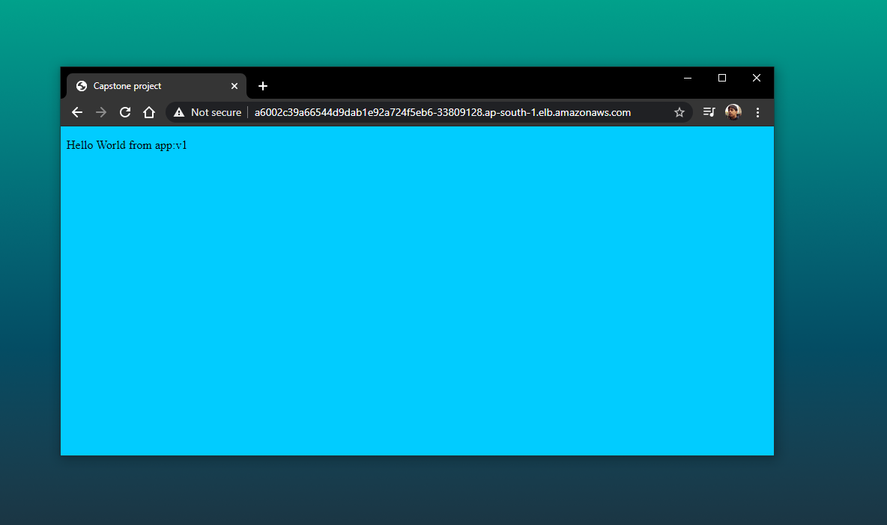
### Deployment appv2 using rolling update
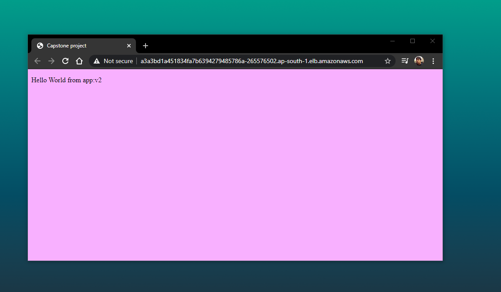
### Pipeline
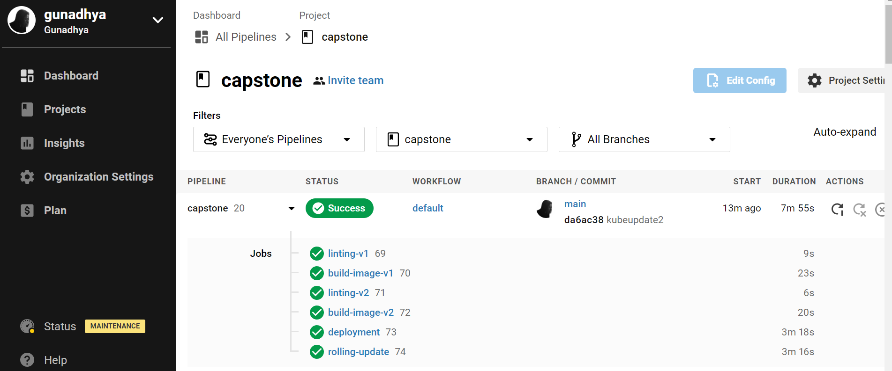


### Active EKS cluster 
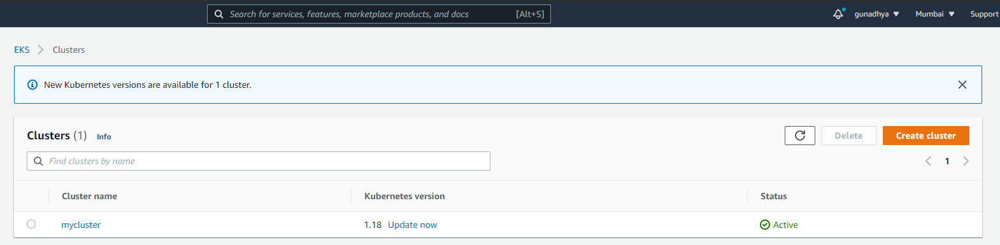
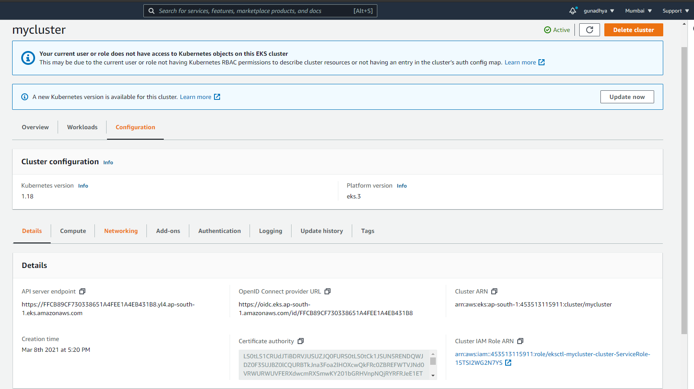

### EC2 dashboard 
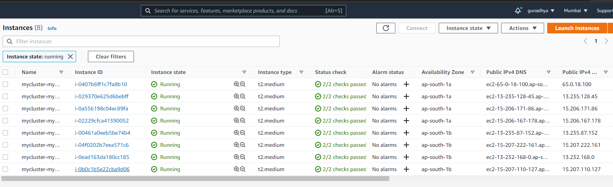

### lint error 1
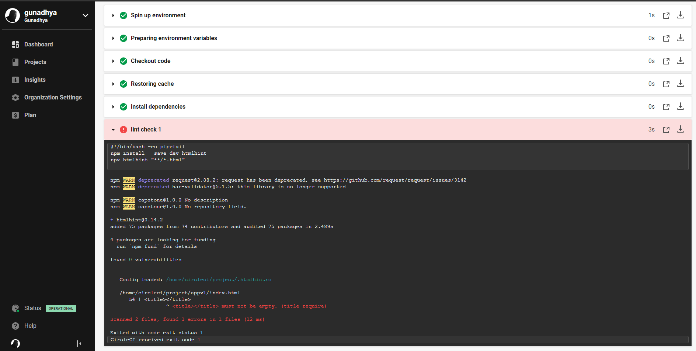
### lint error 2 
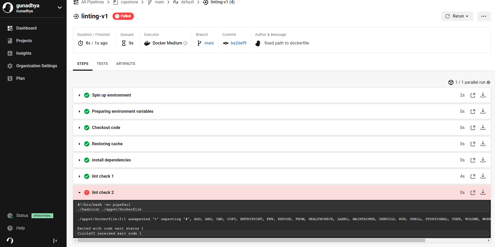

### Cloud formation stack
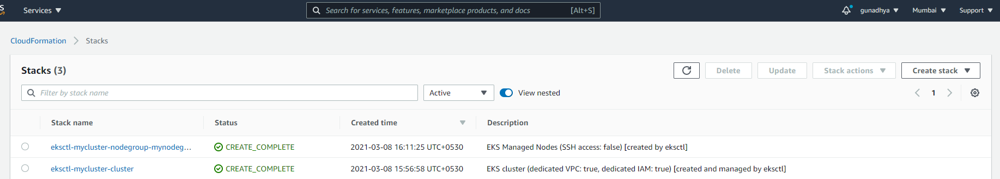

### Docker build and push 
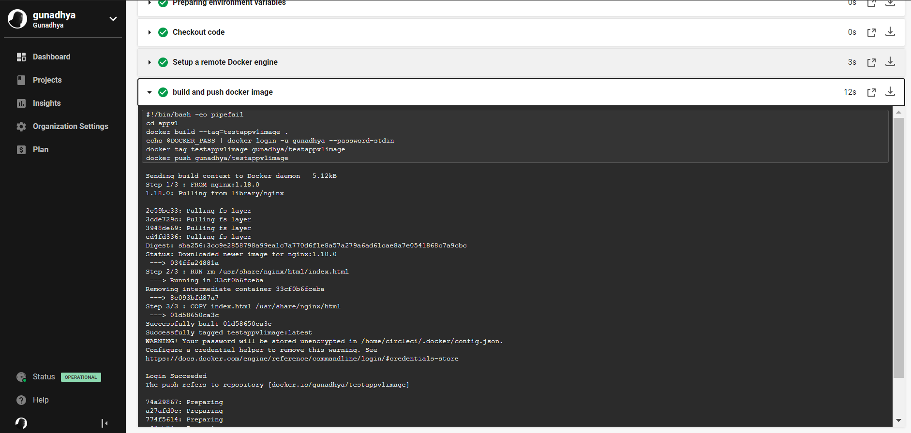

### Successfull deployment
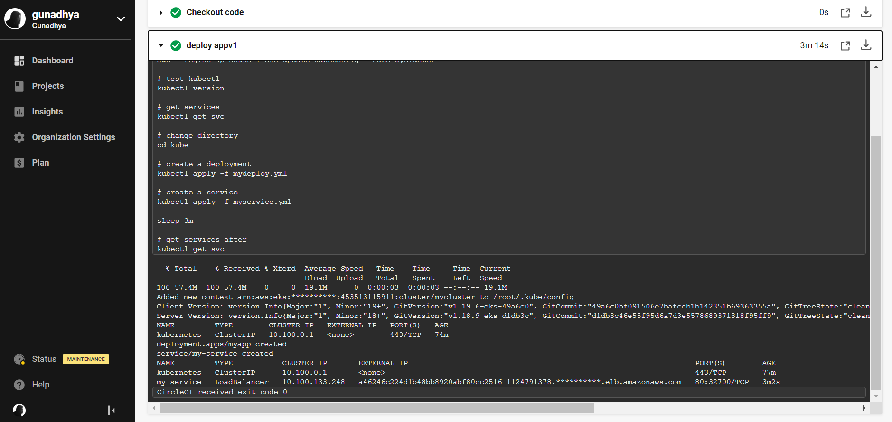

### Successfull rolling update 
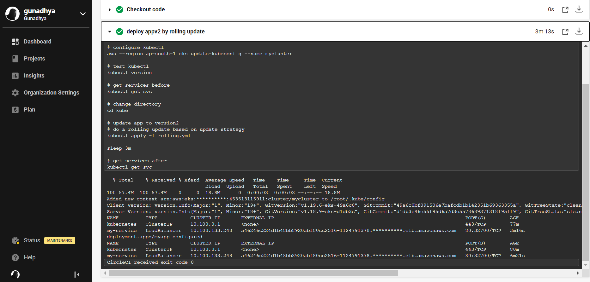


